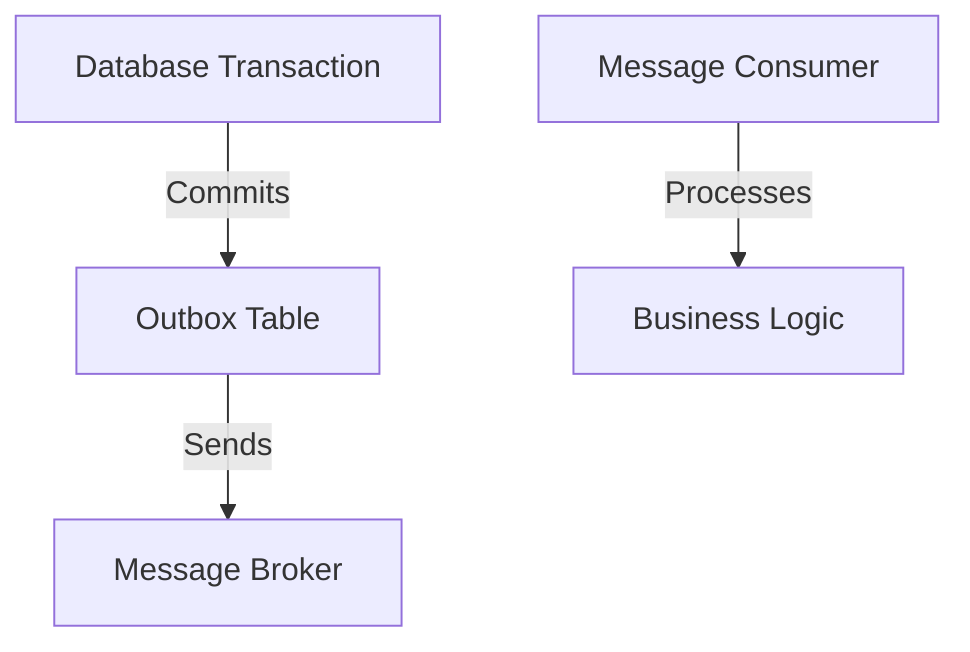

# Transactional Outbox Pattern

This pattern is used to ensure that messages are reliably sent to a message broker in conjunction with a database transaction.

## SQL Statements

```sql
BEGIN;

INSERT INTO outbox (message, status) VALUES ('my message', 'PENDING');

COMMIT;
```

## Mermaid Diagram

